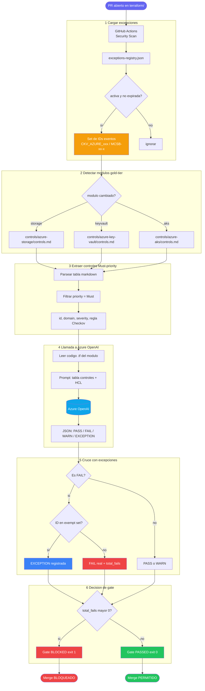

# terraform-sast-lab

PoC de **pipeline de seguridad IaC** para Terraform en Azure.
Demuestra la detección automática de misconfiguraciones de infraestructura en Pull Requests mediante análisis estático + semántico con IA.

---

## Pipeline de seguridad

Cada PR que modifica los módulos gold-tier (`storage`, `keyvault`, `aks`) dispara el workflow `🔒 Terraform Security Check`, que genera **un único comentario** con dos capas de análisis:

```
┌─────────────────────────────────────────────────────────────┐
│              🔒 Terraform Security Report                    │
├─────────────────────────────────────────────────────────────┤
│  📋 Checkov IaC Scan                                        │
│     Análisis estático de todos los ficheros terraform/       │
│     Passed / Failed / Skipped (excepciones registradas)      │
├─────────────────────────────────────────────────────────────┤
│  🤖 AI Security Check (gold-tier modules)                   │
│     Layer 1 — tfsec: reglas deterministas (AVD-AZU-*)       │
│     Layer 2 — Azure OpenAI: controles MCSB Must-priority    │
│     Layer 3 — Exception gate: cross-ref exceptions-registry  │
│                                                             │
│     ❌ Gate: BLOCKED — N FAIL(s) → impide el merge          │
│     ✅ Gate: PASSED  → merge autorizado                     │
└─────────────────────────────────────────────────────────────┘
```

## Módulos gold-tier

| Módulo | Controles MCSB | Must-priority |
|---|---|---|
| `terraform/modules/storage` | ST-001 … ST-012 | 8 controles |
| `terraform/modules/keyvault` | KV-001 … KV-011 | 7 controles |
| `terraform/modules/aks` | AK-001 … AK-013 | 6 controles |

## Exception registry

Las excepciones de control registradas viven en `docs/compliance/exceptions-registry.json`.
Un finding marcado como `FAIL` por el AI check se degrada a `EXCEPTION` si el control tiene un waiver activo y no expirado.
Esto garantiza que solo se bloquea por riesgos **no reconocidos**.

## Probar el gate

```bash
# Crear rama de demo
git checkout -b demo/insecure-storage-config

# Introducir misconfiguraciones intencionadas
# en terraform/modules/storage/main.tf:
#   min_tls_version                 = "TLS1_0"
#   allow_nested_items_to_be_public = true
#   https_traffic_only_enabled      = false

git commit -am "test: introduce insecure storage config"
git push origin demo/insecure-storage-config
# Abrir PR → el pipeline bloquea el merge automáticamente
```

## Configuración

| Secret | Descripción |
|---|---|
| `AZURE_API_KEY` | API key del endpoint Azure OpenAI (`ai-openaidiego-pro.openai.azure.com`) |
| `ARM_CLIENT_ID` | Service Principal para terraform plan/apply |
| `ARM_CLIENT_SECRET` | |
| `ARM_SUBSCRIPTION_ID` | |
| `ARM_TENANT_ID` | |


---

## Lógica del script de análisis IA

> 🎨 **[Abrir diagrama interactivo en FigJam](https://www.figma.com/online-whiteboard/create-diagram/f2a02b17-ef7f-4f0d-9cc2-72d9ab40f0ca?utm_source=claude&utm_content=edit_in_figjam)**

El script `.github/scripts/azure_openai_tf_check.py` orquesta **tres fuentes de datos** y llama a Azure OpenAI para decidir si el merge puede continuar.



---

### Paso a paso

#### `1` Carga de excepciones

Lo primero que hace el script es leer `docs/compliance/exceptions-registry.json` y construir un **set de identificadores exentos**. Solo entran las entradas con `status: active` cuya fecha `expires_at` no ha vencido.

```jsonc
{
  "registry": [
    {
      "id": "EXC-001",
      "status": "active",           // solo activas
      "expires_at": "2026-12-31",   // no expiradas
      "policy_controls": [
        "CKV_AZURE_35",             // ID de regla Checkov
        "MCSB-NS-2"                 // ID de control MCSB
      ]
    }
  ]
}
```

> Cualquier hallazgo cuyo ID aparezca aquí **no cuenta como FAIL** — se degrada a `🔵 EXCEPTION`.

---

#### `2` Detección de módulos gold-tier

El script recibe la lista de archivos modificados en el PR y los mapea a su fichero de controles MCSB:

| Módulo cambiado | Controles MCSB aplicados |
|---|---|
| `terraform/modules/storage/` | `controls/azure-storage/controls.md` |
| `terraform/modules/keyvault/` | `controls/azure-key-vault/controls.md` |
| `terraform/modules/aks/` | `controls/azure-aks/controls.md` |

Cualquier otro módulo se ignora completamente.

---

#### `3` Extracción de controles Must-priority

El script parsea la tabla markdown del `controls.md` y **filtra solo las filas con prioridad `Must`** — los controles obligatorios según MCSB.

```
controls/azure-storage/controls.md
┌──────────┬────────┬──────────┬────────┬──────────────────────────────┬──────────────┐
│ ID       │ Domain │ Severity │ Prio   │ Name                         │ Checkov      │
├──────────┼────────┼──────────┼────────┼──────────────────────────────┼──────────────┤
│ ST-001   │ NS     │ High     │ Must   │ Disable public blob access   │ CKV_AZURE_190│ ← incluido
│ ST-002   │ DP     │ High     │ Must   │ Enforce TLS 1.2+             │ CKV_AZURE_36 │ ← incluido
│ ST-003   │ NS     │ Medium   │ Should │ Restrict network access      │ CKV_AZURE_35 │ ← ignorado
└──────────┴────────┴──────────┴────────┴──────────────────────────────┴──────────────┘
```

---

#### `4` Llamada a Azure OpenAI

Con la tabla de controles y el código `.tf`, el script construye el prompt y llama a la API:

```
System → "Eres revisor de seguridad Terraform para Azure.
          Responde SOLO con un JSON array: [{id, status, finding}]"

User   → "Controles Must-priority: [tabla]
          Código Terraform: [código .tf completo]"
```

Respuesta de la IA:

```json
[
  { "id": "ST-001", "status": "PASS", "finding": "allow_nested_items_to_be_public = false" },
  { "id": "ST-002", "status": "FAIL", "finding": "min_tls_version = TLS1_0, debe ser TLS1_2" },
  { "id": "ST-003", "status": "WARN", "finding": "network_rules no definidas, defaults permisivos" }
]
```

| Estado | Icono | Significado |
|---|---|---|
| `PASS` | ✅ | Control correctamente implementado |
| `FAIL` | ❌ | Control ausente o mal configurado |
| `WARN` | ⚠️ | Cumplimiento parcial o condicional |
| `EXCEPTION` | 🔵 | Anotación `checkov:skip` detectada en el código |

---

#### `5` Cruce con el registro de excepciones

Cada `FAIL` se compara contra el set de IDs exentos cargado en el paso 1:

```
FAIL en ST-002  →  regla Checkov: CKV_AZURE_36
                        │
                        ├─ ¿CKV_AZURE_36 en exempt set?
                        │       ├─ SÍ  →  🔵 EXCEPTION  (no suma a total_fails)
                        │       └─ NO  →  ❌ FAIL real   (+1 a total_fails)
```

---

#### `6` Decisión de gate

```
total_fails == 0  ──►  ✅ Gate: PASSED  ──►  exit(0)  ──►  Merge PERMITIDO
total_fails  > 0  ──►  ❌ Gate: BLOCKED ──►  exit(1)  ──►  Merge BLOQUEADO
```

El reporte se escribe en `ai-check-output.txt`. El workflow lo consume en dos pasos:
- **Enforce gate:** detecta `Gate: BLOCKED` → falla el job → branch protection bloquea el merge
- **Post report:** publica o actualiza el comentario unificado en el PR


---

## Cobertura por tipo de control

No todos los controles MCSB pueden ser verificados por herramientas estáticas.
El pipeline cubre los tres casos:

| Tipo de control | Checkov | tfsec | Azure OpenAI |
|---|---|---|---|
| `IaC Checkable: Yes` + regla Checkov | ✅ | ✅ (si aplica) | ✅ |
| `IaC Checkable: Partial` o regla `Custom` | ⚠️ parcial | ❌ | ✅ **única cobertura** |
| Sin regla Checkov ni tfsec | ❌ | ❌ | ✅ **única cobertura** |

### Por qué importa la capa de IA

Los controles sin regla automática son frecuentemente los más difíciles de verificar:
políticas de acceso, configuraciones de logging, restricciones de red complejas, etc.

Un ejemplo real del repo:

```
ST-008 — Diagnostic logging enabled
  IaC Checkable: Partial
  Checkov: Custom          ← sin regla estándar
  Cobertura: solo Azure OpenAI
```

En este caso, si el módulo no configura `azurerm_monitor_diagnostic_setting`,
**solo la IA lo detectará** como FAIL y bloqueará el merge.

### Flujo de cobertura para un control sin Checkov

```
Control Must sin regla Checkov
        │
        ├─ Checkov   → no lo evalúa (sin regla)
        ├─ tfsec     → no lo evalúa (sin regla)
        └─ OpenAI    → SÍ analiza semánticamente el HCL  ← única cobertura
                            │
                            ├─ FAIL + excepción MCSB registrada  →  EXCEPTION
                            ├─ FAIL sin excepción                →  Gate: BLOCKED
                            └─ PASS / WARN                       →  continúa
```

> Para registrar una excepción sobre un control sin Checkov, usa el ID MCSB
> (`"MCSB-LT-3"`) en lugar del ID de regla Checkov en `exceptions-registry.json`.


## Estructura

```
.github/
  workflows/
    security-check.yml      # Pipeline principal — Checkov + tfsec + AI
    codeql.yml              # SAST de scripts Python
    compliance-report.yml   # Dashboard MCSB semanal (push a main)
    terraform.yml           # Apply en merge a main
  scripts/
    azure_openai_tf_check.py
controls/
  azure-storage/controls.md
  azure-key-vault/controls.md
  azure-aks/controls.md
  … (36 servicios Azure)
  MCSB-control-matrix.md
terraform/
  main.tf                   # Root config (providers + módulos)
  variables.tf
  modules/
    storage/   keyvault/   aks/
docs/compliance/
  exceptions-registry.json
```

---

## Arquitectura de la solución

> **Diagrama interactivo en FigJam:** [Abrir en FigJam](https://www.figma.com/online-whiteboard/create-diagram/3c2635d5-c1c6-47f3-b78e-8b5cdf4535e9?utm_source=claude&utm_content=edit_in_figjam)


### Flujo detallado

| Paso | Herramienta | Scope | Acción si falla |
|------|-------------|-------|-----------------|
| 1 | **Checkov** | Todos los archivos `terraform/` | Reporta en comentario (no bloquea solo) |
| 2 | **tfsec** | Módulos gold-tier (`storage`, `keyvault`, `aks`) | Reporta en comentario |
| 3 | **Azure OpenAI** | Módulos gold-tier | Emite veredicto `PASS` / `BLOCKED` |
| 4 | **Gate enforcement** | — | `exit 1` si el veredicto es `BLOCKED` |
| 5 | **Branch protection** | Rama `main` | Bloquea el merge hasta que `Security Scan` pase |

### Excepciones

Las excepciones conocidas y aceptadas se registran en `docs/compliance/exceptions-registry.json`.
El script de Azure OpenAI las carga antes de evaluar para evitar falsos positivos sobre riesgos ya gestionados.

