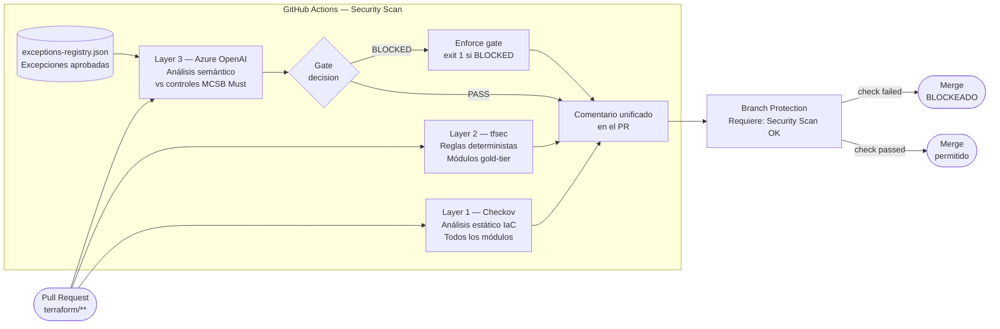

# terraform-sast-lab

PoC de **pipeline de seguridad IaC** para Terraform en Azure.
Demuestra la detección automática de misconfiguraciones de infraestructura en Pull Requests mediante análisis estático + semántico con IA.

---

## Pipeline de seguridad

Cada PR que modifica los módulos gold-tier (`storage`, `keyvault`, `aks`) dispara el workflow `🔒 Terraform Security Check`, que genera **un único comentario** con dos capas de análisis:

```
┌─────────────────────────────────────────────────────────────┐
│              🔒 Terraform Security Report                    │
├─────────────────────────────────────────────────────────────┤
│  📋 Checkov IaC Scan                                        │
│     Análisis estático de todos los ficheros terraform/       │
│     Passed / Failed / Skipped (excepciones registradas)      │
├─────────────────────────────────────────────────────────────┤
│  🤖 AI Security Check (gold-tier modules)                   │
│     Layer 1 — tfsec: reglas deterministas (AVD-AZU-*)       │
│     Layer 2 — Azure OpenAI: controles MCSB Must-priority    │
│     Layer 3 — Exception gate: cross-ref exceptions-registry  │
│                                                             │
│     ❌ Gate: BLOCKED — N FAIL(s) → impide el merge          │
│     ✅ Gate: PASSED  → merge autorizado                     │
└─────────────────────────────────────────────────────────────┘
```

## Módulos gold-tier

| Módulo | Controles MCSB | Must-priority |
|---|---|---|
| `terraform/modules/storage` | ST-001 … ST-012 | 8 controles |
| `terraform/modules/keyvault` | KV-001 … KV-011 | 7 controles |
| `terraform/modules/aks` | AK-001 … AK-013 | 6 controles |

## Exception registry

Las excepciones de control registradas viven en `docs/compliance/exceptions-registry.json`.
Un finding marcado como `FAIL` por el AI check se degrada a `EXCEPTION` si el control tiene un waiver activo y no expirado.
Esto garantiza que solo se bloquea por riesgos **no reconocidos**.

## Probar el gate

```bash
# Crear rama de demo
git checkout -b demo/insecure-storage-config

# Introducir misconfiguraciones intencionadas
# en terraform/modules/storage/main.tf:
#   min_tls_version                 = "TLS1_0"
#   allow_nested_items_to_be_public = true
#   https_traffic_only_enabled      = false

git commit -am "test: introduce insecure storage config"
git push origin demo/insecure-storage-config
# Abrir PR → el pipeline bloquea el merge automáticamente
```

## Configuración

| Secret | Descripción |
|---|---|
| `AZURE_API_KEY` | API key del endpoint Azure OpenAI (`ai-openaidiego-pro.openai.azure.com`) |
| `ARM_CLIENT_ID` | Service Principal para terraform plan/apply |
| `ARM_CLIENT_SECRET` | |
| `ARM_SUBSCRIPTION_ID` | |
| `ARM_TENANT_ID` | |

## Estructura

```
.github/
  workflows/
    security-check.yml      # Pipeline principal — Checkov + tfsec + AI
    codeql.yml              # SAST de scripts Python
    compliance-report.yml   # Dashboard MCSB semanal (push a main)
    terraform.yml           # Apply en merge a main
  scripts/
    azure_openai_tf_check.py
controls/
  azure-storage/controls.md
  azure-key-vault/controls.md
  azure-aks/controls.md
  … (36 servicios Azure)
  MCSB-control-matrix.md
terraform/
  main.tf                   # Root config (providers + módulos)
  variables.tf
  modules/
    storage/   keyvault/   aks/
docs/compliance/
  exceptions-registry.json
```

---

## Arquitectura de la solución

> **Diagrama interactivo en FigJam:** [Abrir en FigJam](https://www.figma.com/online-whiteboard/create-diagram/3c2635d5-c1c6-47f3-b78e-8b5cdf4535e9?utm_source=claude&utm_content=edit_in_figjam)



### Flujo detallado

| Paso | Herramienta | Scope | Acción si falla |
|------|-------------|-------|-----------------|
| 1 | **Checkov** | Todos los archivos `terraform/` | Reporta en comentario (no bloquea solo) |
| 2 | **tfsec** | Módulos gold-tier (`storage`, `keyvault`, `aks`) | Reporta en comentario |
| 3 | **Azure OpenAI** | Módulos gold-tier | Emite veredicto `PASS` / `BLOCKED` |
| 4 | **Gate enforcement** | — | `exit 1` si el veredicto es `BLOCKED` |
| 5 | **Branch protection** | Rama `main` | Bloquea el merge hasta que `Security Scan` pase |

### Excepciones

Las excepciones conocidas y aceptadas se registran en `docs/compliance/exceptions-registry.json`.
El script de Azure OpenAI las carga antes de evaluar para evitar falsos positivos sobre riesgos ya gestionados.

